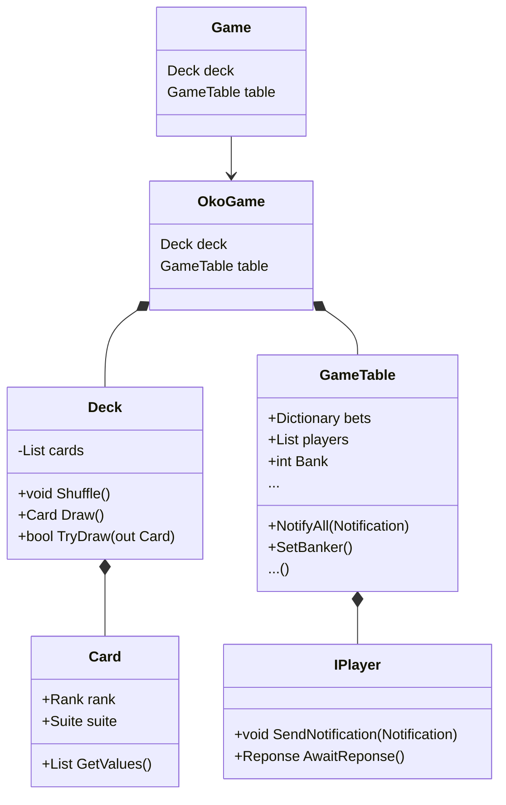
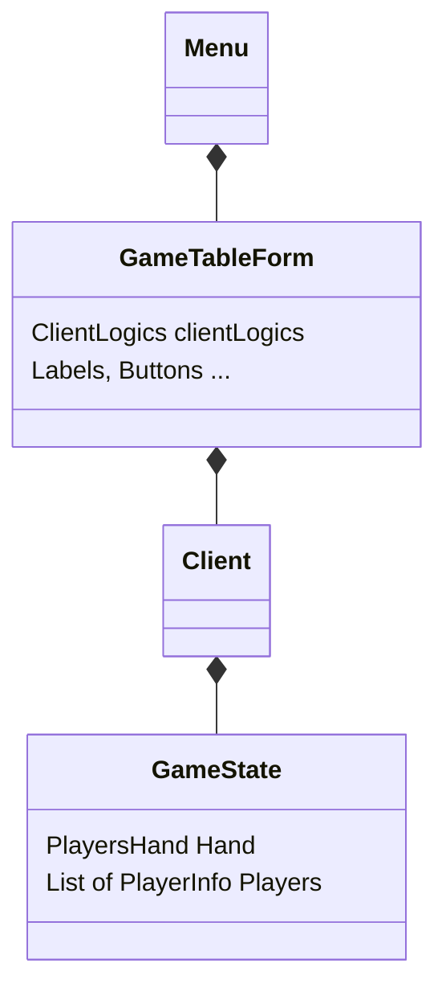
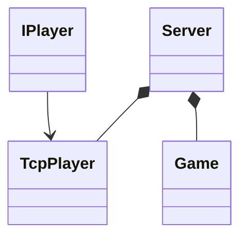

# Technical documentation

This documentation is rather high-level overview as most of the documentation is present in the code. 

Anyway, the game is separated to three main parts - **Client**, **Server** and **Common**.

---

### Common part

As it is used by both I will start with the common part.

It contains game implementation - main game loop, one round, playing deck, playing cards. I need to emphasise that the common part can't be used by itself as the provided players are only abstract and needs to be implemented in other parts.

Here is simplified overview of Common part architecture.

---

### Client part

This part is WinForm executable which will be used by client to connect to server.

It is implementation is simple - the main portion of it consists of handling updates received form server, changing UI and responding with corresponding data.

---

### Server part

The last part mainly implements IPlayer so it can be used in actual game.

It also obviously provides a server that clients can connect to that host the actual game.

---

## Communication

For the game I have chosen communicating over TCP using JSONs as it is really simple.

This choice however might not be the best for real-world usage as my implementation was lacking necessary security elements.
