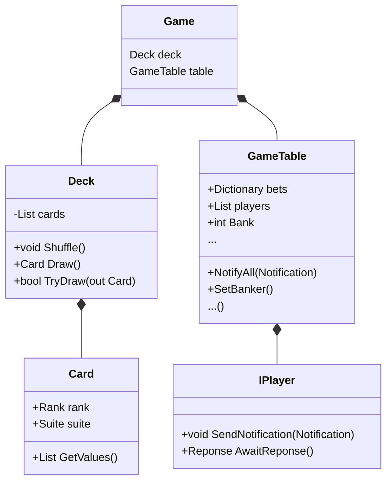
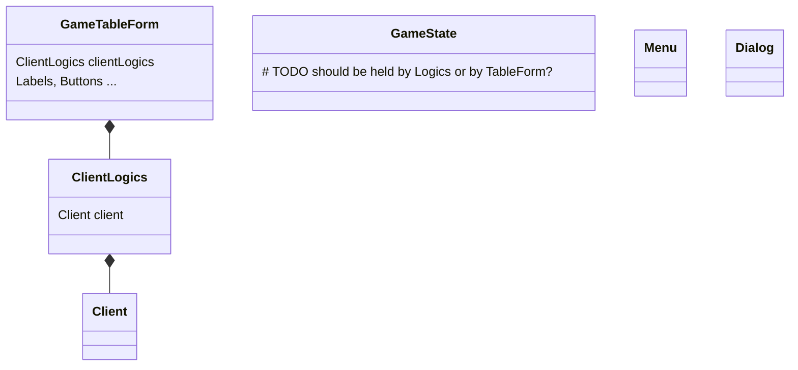
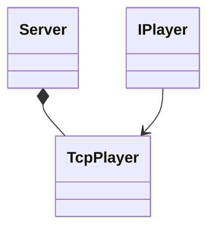

# Technical documentation

The game is separated to three main parts - **Client**, **Server** and **Common**.

...

---

### Common part

As it is used by both I will start with the common part.

It contains game implementation - one round, deck, playing cards... even though the parts where real players will be
necessary is only through interfaces which needs to be implemented in other parts.

Here is simplified overview of Common part architecture.

---

### Client part

This part is WinForm executable which will be used by client to connect to server.

---

### Server part

The last part implements IPlayer so it can be used and also provides way to run it in parallel with accepting new
clients. ...

## Communication

## ...
